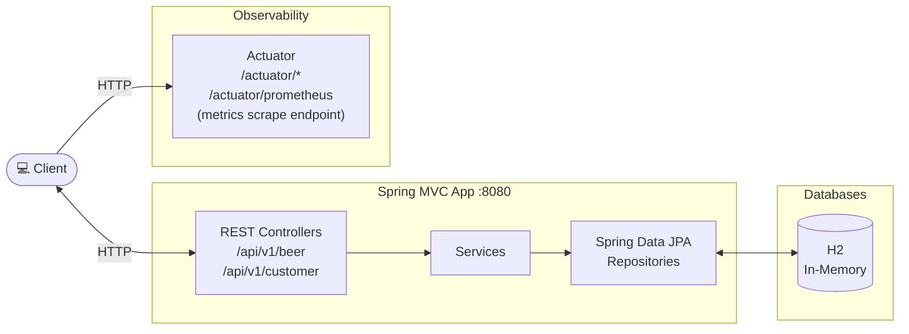

# SFG Beer Works - RESTful Brewery Service

This project is to support learning about Restful APIs.

You can access the API documentation [here](https://sfg-beer-works.github.io/brewery-api/#tag/Beer-Service)

This project has been upgraded to Spring Boot 4.1.1 on Java 25.
Original git repository: https://github.com/springframeworkguru/kbe-rest-brewery

## Architecture Overview



## Sandbox (local dev environment)

The sandbox is provisioned by the opencode-sandbox-kit and runs as a Docker container. It mounts this
repo, starts the agent, and connects the IntelliJ MCP server.

Allow the kit source (GitHub without cloning):

```powershell
sbx settings set kit.allowedSources --% "[\"docker.io/\",\"codeberg.org/dboeckli/\"]"
```

Start a new sandbox:

```powershell
sbx run opencode `
    --kit "git+https://codeberg.org/dboeckli/opencode-sandbox-kit.git#dir=opencode-agent" `
    --template docker.cloudsmith.io/dboeckli/sbx/sbx-opencode-tooling:latest `
    --skills=off `
    --static-mcp idea `
    . `
    "C:\development\maven-repo:ro"
```

Start the sandbox with Kubernetes support:

```powershell
sbx run opencode `
    --kit "git+https://codeberg.org/dboeckli/opencode-sandbox-kit.git#dir=opencode-agent" `
    --template docker.cloudsmith.io/dboeckli/sbx/sbx-opencode-tooling:latest `
    --skills=off `
    --static-mcp idea `
    . `
    "C:\development\maven-repo:ro" `
    "$env:USERPROFILE\.kube:ro"
```

Claude variant (Home):

```powershell
sbx run claude `
    --kit "git+https://codeberg.org/dboeckli/opencode-sandbox-kit.git#dir=opencode-agent" `
    --template docker.cloudsmith.io/dboeckli/sbx/sbx-claude-tooling:latest `
    --skills=off `
    --static-mcp idea `
    . `
    "C:\development\maven-repo:ro"
```

Mammouth (template pin lives in the spec image):

```powershell
sbx run "git+https://codeberg.org/dboeckli/opencode-sandbox-kit.git#dir=mammouth-agent" `
    --kit-arg imageTag=latest `
    --skills=off `
    --static-mcp idea `
    . `
    "C:\development\maven-repo:ro"
```

Apply the kit to an existing sandbox (restarts the sandbox, VM state is kept):

```powershell
sbx kit add opencode-kbe-rest-brewery "git+https://codeberg.org/dboeckli/opencode-sandbox-kit.git#dir=opencode-agent"
```

> **Sandbox quirk:** the sandbox kit already sets `npm_config_bin_links=false` globally, so
> Spotless/prettier works on the mounted workspace without any manual export.

## Build project

`./mvnw clean install` builds the project, creates the Docker image `local/kbe-rest-brewery:development`
(plus `local/kbe-rest-brewery:<helm.chart.version>`) and packages the Helm chart into `target/helm/repo/`.

### Docker Commands

#### Simple und directory docker

Build

```
docker build  -f ./docker/Dockerfile -t kbe-rest . 
```

Run

```
docker run -p 8080:8080 -d kbe-rest 
```

or without daeomon flag

```
docker run -p 8080:8080 kbe-rest 
```

check what is running

```
docker ps 
```

stop running container

```
docker stop [container-id] 
```

#### Layered und directory dockerLayered

needs maven configuration for spring-boot-maven-plugin

``` docker build  -f ./dockerLayered/Dockerfile -t kbe-rest . ```

### Kubernetes Command

Generate Kubernetes Deployment Yaml

```
kubectl create deployment kbe-rest-brewery --image=local/kbe-rest-brewery:0.0.1-SNAPSHOT --dry-run=client -o yaml > kbe-rest-brewery-deployment.yaml
```

Apply Deployment Yaml

```
kubectl apply -f kbe-rest-brewery-deployment.yaml
```

Check Deployment

```
kubectl get all
```

Generate Kubernetes Service Yaml

```
kubectl create service clusterip kbe-rest-brewery --tcp=8080:8080 --dry-run=client -o yaml > kbe-rest-brewery-service.yaml
```

Apply Service Yaml

```
kubectl apply -f kbe-rest-brewery-service.yaml
```

Check Service

```
kubectl get all
```

Expose Port 8080 and redirect traffic to our service in the internal network. This command is blocking. Ctl-C to terminate.

```
kubectl port-forward service/kbe-rest-brewery 8080:8080
```

Another and better approach is using the Ingress Controller. See gateway project how to do it.
A third way is to change the service and using the NodePort (```type: NodePort``` instead of ```type: ClusterIP```)
This expose a random port (get it with ```kubectl get all ```)

Stop and Remove Service and Deployment

```
kubectl delete service kbe-rest-brewery
kubectl delete deployment kbe-rest-brewery
```

Show logs
First get the Pod Id with ```kubectl get all ```

```
kubectl logs --tail=20 kbe-rest-brewery-6bd69bf9d8-4js4j
```

follow logs

```
kubectl logs -f kbe-rest-brewery-6bd69bf9d8-4js4j
```

### Deployment with Helm

Be aware that we are using a different namespace here (not default).

To run maven filtering for destination target/helm (skip the Docker image build with
`-Dskip.docker.build=true`)

```bash
./mvnw clean install -DskipTests
```

Go to the directory where the tgz file has been created after `./mvnw clean install`

```powershell
cd target/helm/repo
```

unpack

```powershell
$file = Get-ChildItem -Filter kbe-rest-brewery-chart-*.tgz | Select-Object -First 1
tar -xvf $file.Name
```

install

```powershell
$APPLICATION_NAME = Get-ChildItem -Directory | Where-Object { $_.LastWriteTime -ge $file.LastWriteTime } | Select-Object -ExpandProperty Name
helm upgrade --install $APPLICATION_NAME ./$APPLICATION_NAME --namespace kbe-rest-brewery --create-namespace --wait --timeout 8m --debug --render-subchart-notes
```

show logs

```powershell
kubectl get pods -l app.kubernetes.io/name=$APPLICATION_NAME -n kbe-rest-brewery
```

replace $POD with pods from the command above

```powershell
kubectl logs $POD -n kbe-rest-brewery --all-containers
```

test

```powershell
helm test $APPLICATION_NAME --namespace kbe-rest-brewery --logs
```

uninstall

```powershell
helm uninstall $APPLICATION_NAME --namespace kbe-rest-brewery
```

delete all

```powershell
kubectl delete all --all -n kbe-rest-brewery
```

create busybox sidecar

```powershell
kubectl run busybox-test --rm -it --image=busybox:1.36 --namespace=kbe-rest-brewery --command -- sh
```

You can use the actuator rest call to verify via port 30080

